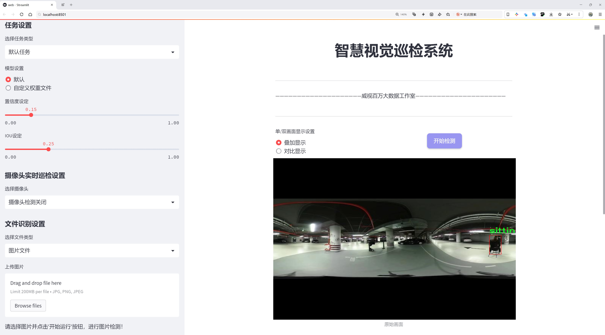
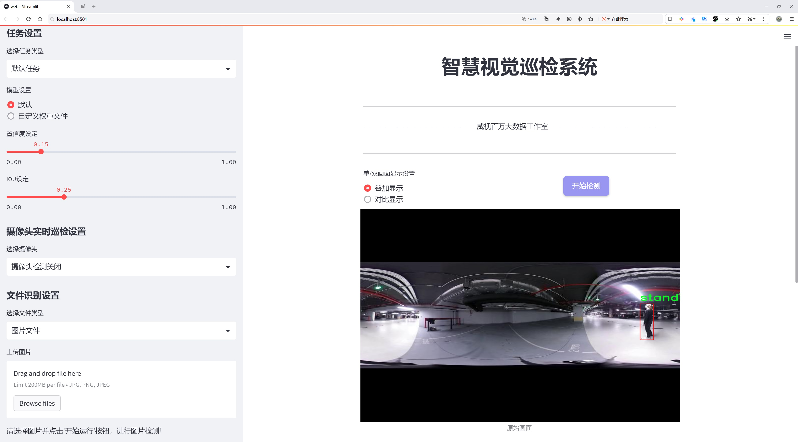
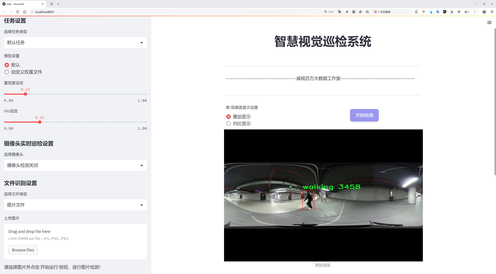
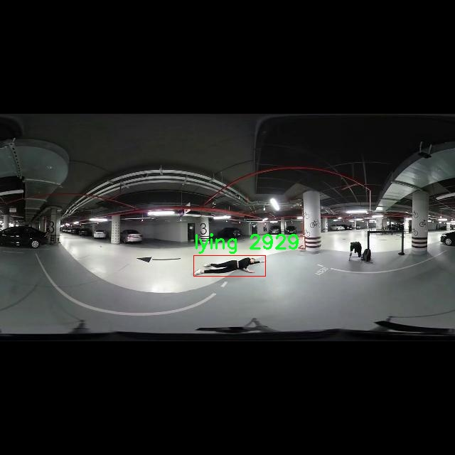
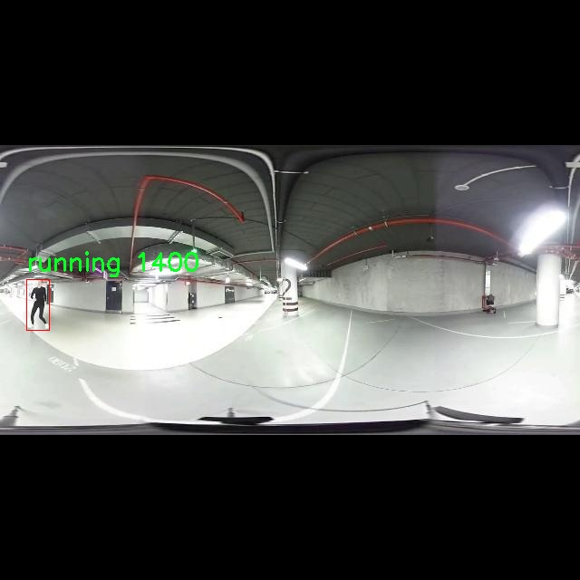
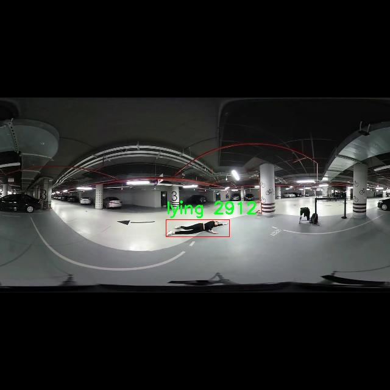
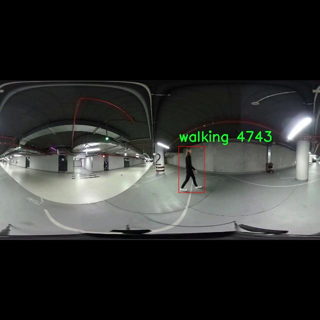
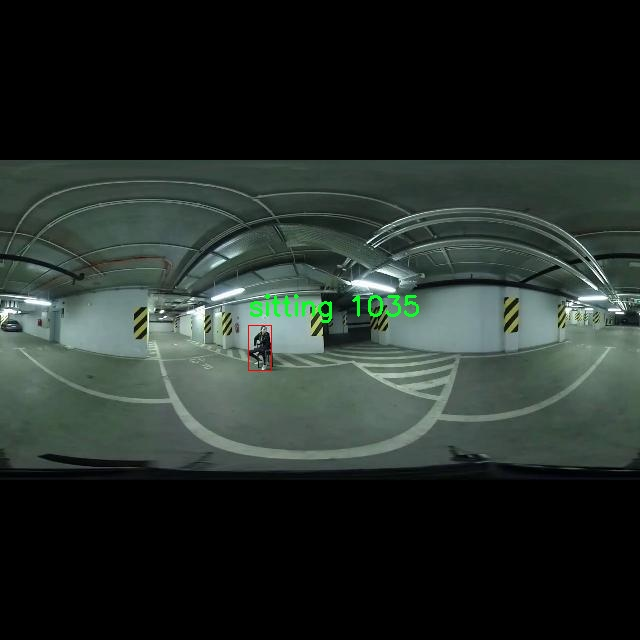

# 人类行为识别检测系统源码分享
 # [一条龙教学YOLOV8标注好的数据集一键训练_70+全套改进创新点发刊_Web前端展示]

### 1.研究背景与意义

项目参考[AAAI Association for the Advancement of Artificial Intelligence](https://gitee.com/qunshansj/projects)

项目来源[AACV Association for the Advancement of Computer Vision](https://gitee.com/qunmasj/projects)

研究背景与意义

随着智能监控技术和人工智能的发展，人类行为识别系统在安全监控、智能家居、医疗护理等领域的应用日益广泛。传统的行为识别方法往往依赖于手工特征提取和复杂的模型设计，导致其在实时性和准确性方面的局限性。近年来，深度学习技术的快速进步为行为识别提供了新的解决方案，尤其是基于卷积神经网络（CNN）的目标检测算法，如YOLO（You Only Look Once）系列模型，因其高效的实时检测能力而受到广泛关注。

YOLOv8作为YOLO系列的最新版本，具备了更强的特征提取能力和更快的推理速度，使其在复杂场景下的人类行为识别中展现出优越的性能。然而，尽管YOLOv8在目标检测领域取得了显著进展，但在特定应用场景下，如人类行为识别，仍然面临一些挑战。具体而言，行为的多样性和复杂性使得模型在不同环境下的泛化能力受到限制。因此，针对YOLOv8进行改进，以提升其在特定人类行为识别任务中的表现，具有重要的研究意义。

本研究将基于HumanActivity360数据集进行实验，该数据集包含2500张图像，涵盖了六种基本的人类行为类别：跌倒、躺下、奔跑、坐着、站立和行走。这些行为类别的选择不仅反映了日常生活中的常见活动，也与安全监控和健康监测等实际应用密切相关。通过对这些行为的准确识别，可以为老年人和行动不便者提供及时的安全保障，同时也为运动员的训练和康复提供数据支持。

在数据集的构建方面，HumanActivity360数据集的多样性和丰富性为模型的训练和验证提供了良好的基础。该数据集的图像数量和类别设置，使得模型能够学习到不同环境下的行为特征，进而提高其识别的准确性和鲁棒性。此外，利用改进的YOLOv8模型进行训练，可以充分挖掘数据集中的潜在信息，提升模型对复杂行为的识别能力。

本研究的意义不仅在于推动人类行为识别技术的发展，更在于为相关领域的实际应用提供理论支持和技术保障。通过对YOLOv8的改进，我们期望能够实现更高效、更准确的人类行为识别系统，从而为智能监控、医疗护理等领域的应用提供更为可靠的技术手段。此外，研究成果还将为后续的行为识别研究提供新的思路和方法，推动该领域的进一步发展。

综上所述，基于改进YOLOv8的人类行为识别系统的研究，不仅具有重要的学术价值，也为实际应用提供了广阔的前景。通过深入探讨该领域的关键技术与应用场景，我们期待能够为人类社会的安全与健康贡献一份力量。

### 2.图片演示







##### 注意：由于此博客编辑较早，上面“2.图片演示”和“3.视频演示”展示的系统图片或者视频可能为老版本，新版本在老版本的基础上升级如下：（实际效果以升级的新版本为准）

  （1）适配了YOLOV8的“目标检测”模型和“实例分割”模型，通过加载相应的权重（.pt）文件即可自适应加载模型。

  （2）支持“图片识别”、“视频识别”、“摄像头实时识别”三种识别模式。

  （3）支持“图片识别”、“视频识别”、“摄像头实时识别”三种识别结果保存导出，解决手动导出（容易卡顿出现爆内存）存在的问题，识别完自动保存结果并导出到tempDir中。

  （4）支持Web前端系统中的标题、背景图等自定义修改，后面提供修改教程。

  另外本项目提供训练的数据集和训练教程,暂不提供权重文件（best.pt）,需要您按照教程进行训练后实现图片演示和Web前端界面演示的效果。

### 3.视频演示

[3.1 视频演示](https://www.bilibili.com/video/BV1JRtvecEad/)

### 4.数据集信息展示

##### 4.1 本项目数据集详细数据（类别数＆类别名）

nc: 6
names: ['falling', 'lying', 'running', 'sitting', 'standing', 'walking']


##### 4.2 本项目数据集信息介绍

数据集信息展示

在现代计算机视觉领域，人类行为识别作为一个重要的研究方向，受到了广泛的关注。为了提升这一领域的研究效果，尤其是在改进YOLOv8模型的过程中，选用合适的数据集显得尤为重要。在此背景下，"HumanActivity360"数据集应运而生，成为了训练和验证人类行为识别系统的理想选择。

"HumanActivity360"数据集专注于六种主要的人类行为类别，具体包括：跌倒（falling）、躺下（lying）、奔跑（running）、坐下（sitting）、站立（standing）和行走（walking）。这些类别涵盖了日常生活中常见的动作，能够为模型提供丰富的训练样本，从而增强其对人类行为的识别能力。数据集中每个类别的样本均经过精心标注，确保了数据的准确性和一致性。这种高质量的标注不仅有助于提高模型的训练效果，还能有效减少模型在实际应用中的误识别率。

数据集的设计理念是全面而细致的，力求在多样性和代表性之间取得平衡。每种行为类别都包含了大量的样本，涵盖了不同的场景、光照条件和个体差异。这种多样性使得模型在训练过程中能够学习到更为丰富的特征，从而在面对复杂的现实环境时，依然能够保持较高的识别准确率。例如，在跌倒和躺下的类别中，数据集不仅包含了静态图像，还包括了动态视频片段，帮助模型理解这些行为的时间维度和空间变化。

此外，"HumanActivity360"数据集还考虑到了不同个体在执行相同行为时的差异性。通过收集来自不同年龄、性别和体型的参与者的数据，数据集确保了模型在训练时能够学习到更加广泛的行为特征。这种个体差异的考虑，使得最终训练出的模型在实际应用中能够更好地适应不同用户的行为模式，从而提升了人类行为识别系统的普适性和可靠性。

在数据集的使用过程中，研究人员可以通过多种方式对数据进行扩展和增强，以适应不同的实验需求。例如，利用数据增强技术，可以对原始图像进行旋转、缩放、裁剪等处理，从而生成更多的训练样本，进一步提升模型的泛化能力。同时，研究人员还可以根据具体的应用场景，选择性地提取某些类别的数据进行重点训练，以优化模型在特定行为识别上的表现。

总之，"HumanActivity360"数据集为改进YOLOv8的人类行为识别系统提供了坚实的基础。其丰富的类别信息、准确的标注以及多样化的样本设计，使得该数据集在推动人类行为识别技术的发展中发挥了重要作用。随着研究的深入，利用这一数据集训练出的模型将能够在实际应用中展现出更为卓越的性能，为智能监控、健康管理等领域带来新的机遇与挑战。











### 5.全套项目环境部署视频教程（零基础手把手教学）

[5.1 环境部署教程链接（零基础手把手教学）](https://www.ixigua.com/7404473917358506534?logTag=c807d0cbc21c0ef59de5)


[5.2 安装Python虚拟环境创建和依赖库安装视频教程链接（零基础手把手教学）](https://www.ixigua.com/7404474678003106304?logTag=1f1041108cd1f708b01a)

### 6.手把手YOLOV8训练视频教程（零基础小白有手就能学会）

[6.1 手把手YOLOV8训练视频教程（零基础小白有手就能学会）](https://www.ixigua.com/7404477157818401292?logTag=d31a2dfd1983c9668658)

### 7.70+种全套YOLOV8创新点代码加载调参视频教程（一键加载写好的改进模型的配置文件）

[7.1 70+种全套YOLOV8创新点代码加载调参视频教程（一键加载写好的改进模型的配置文件）](https://www.ixigua.com/7404478314661806627?logTag=29066f8288e3f4eea3a4)

### 8.70+种全套YOLOV8创新点原理讲解（非科班也可以轻松写刊发刊，V10版本正在科研待更新）

由于篇幅限制，每个创新点的具体原理讲解就不一一展开，具体见下列网址中的创新点对应子项目的技术原理博客网址【Blog】：


[8.1 70+种全套YOLOV8创新点原理讲解链接](https://gitee.com/qunmasj/good)

### 9.系统功能展示（检测对象为举例，实际内容以本项目数据集为准）

图9.1.系统支持检测结果表格显示

  图9.2.系统支持置信度和IOU阈值手动调节

  图9.3.系统支持自定义加载权重文件best.pt(需要你通过步骤5中训练获得)

  图9.4.系统支持摄像头实时识别

  图9.5.系统支持图片识别

  图9.6.系统支持视频识别

  图9.7.系统支持识别结果文件自动保存

  图9.8.系统支持Excel导出检测结果数据


### 10.原始YOLOV8算法原理

原始YOLOv8算法原理

YOLOv8作为目标检测领域的最新进展，继承并发展了YOLO系列的核心思想，其设计理念旨在实现高效、快速且准确的目标检测。该算法的结构主要由输入层、主干网络、颈部网络和头部网络四个部分组成，每个部分在整个检测流程中都扮演着至关重要的角色。输入层负责将原始图像缩放至模型所需的输入尺寸，以便后续的特征提取和处理。主干网络则通过一系列卷积操作对图像进行下采样，提取出有用的特征信息。每个卷积层不仅应用了批归一化技术以加速训练过程，还采用了SiLU激活函数来增强模型的非线性表达能力。

在主干网络中，YOLOv8引入了C2f模块，这一模块的设计灵感源自于YOLOv7中的E-ELAN结构。C2f模块通过跨层分支连接，显著增强了模型的梯度流动性，使得网络在训练过程中能够更有效地传播信息。这种设计不仅提高了特征提取的丰富性，还有效改善了检测结果的准确性。此外，主干网络的末尾引入了SPPFl块，通过三个最大池化层的组合，进一步增强了网络对多尺度特征的抽象能力，使得模型在处理不同尺寸目标时表现得更加灵活。

颈部网络则是YOLOv8的一个重要创新点，采用了PAN-FPN结构来融合来自不同尺度特征图的信息。这一结构的设计使得网络能够有效地整合多层次的特征信息，从而提高目标检测的准确性和鲁棒性。颈部网络的输出将被传递至头部网络，后者采用了解耦的检测头结构，将分类和回归任务分开处理。这种解耦设计使得模型在处理复杂场景时，能够更清晰地分配资源，从而提升整体性能。

YOLOv8在损失计算方面也进行了创新，采用了BCELoss作为分类损失，DFLLoss与CIoULoss作为回归损失。这种多损失函数的组合，旨在提高模型的训练效率和检测精度。通过精细化的损失计算，YOLOv8能够更好地学习到目标的特征，进而在实际应用中实现更高的检测性能。

在数据增强方面，YOLOv8借鉴了YOLOv5的设计理念，在训练的最后10个epoch中关闭马赛克增强，并采用动态Task-Aligned Assigner样本分配策略。这一策略的引入，旨在通过更合理的样本分配，提升模型的泛化能力，使其在不同场景下均能保持良好的检测效果。

值得一提的是，YOLOv8提供了多种不同尺度的模型选择，包括n、s、m、l、x五种模型。这些模型的设计并不是简单地遵循固定的缩放系数，而是在改变缩放系数的同时，灵活调整主干网络的通道数，以实现性能的最优化。这种灵活性使得YOLOv8能够适应不同的应用场景，无论是在资源受限的环境中，还是在需要高精度检测的复杂场景中，YOLOv8都能展现出其独特的优势。

总的来说，YOLOv8通过一系列创新的设计，极大地提升了目标检测的效率和准确性。其在主干网络中引入的C2f模块、颈部网络的PAN-FPN结构、解耦的检测头以及多样化的损失计算方式，都是为了实现更高效的特征提取和更精准的目标定位。随着YOLOv8的发布，目标检测领域的研究和应用将迎来新的机遇，尤其是在实时检测的需求日益增长的背景下，YOLOv8无疑将成为一个重要的技术基础。

在实际应用中，YOLOv8的高效性和准确性使其在农业、安防、交通监控等多个领域展现出广泛的应用潜力。例如，在苹果采摘的场景中，YOLOv8能够利用其强大的视觉识别能力，自动检测和定位苹果，为自动采摘机器人提供精准的目标信息。这一应用不仅提高了采摘效率，还降低了人工成本，展现了YOLOv8在农业自动化中的巨大潜力。

综上所述，YOLOv8不仅是YOLO系列算法的延续，更是目标检测技术的一次重要飞跃。其在各个方面的创新设计，使得YOLOv8在实际应用中具备了更强的适应性和灵活性，为未来的目标检测研究提供了新的方向和思路。随着技术的不断进步，YOLOv8无疑将在更多领域发挥其重要作用，推动目标检测技术的进一步发展。


### 11.项目核心源码讲解（再也不用担心看不懂代码逻辑）

#### 11.1 70+种YOLOv8算法改进源码大全和调试加载训练教程（非必要）\ultralytics\nn\backbone\CSwomTramsformer.py

以下是对代码的核心部分进行分析和详细注释的结果：

```python
import torch
import torch.nn as nn
import numpy as np

class Mlp(nn.Module):
    """多层感知机（MLP）模块"""
    def __init__(self, in_features, hidden_features=None, out_features=None, act_layer=nn.GELU, drop=0.):
        super().__init__()
        out_features = out_features or in_features  # 输出特征数默认为输入特征数
        hidden_features = hidden_features or in_features  # 隐藏层特征数默认为输入特征数
        self.fc1 = nn.Linear(in_features, hidden_features)  # 第一层线性变换
        self.act = act_layer()  # 激活函数
        self.fc2 = nn.Linear(hidden_features, out_features)  # 第二层线性变换
        self.drop = nn.Dropout(drop)  # Dropout层

    def forward(self, x):
        """前向传播"""
        x = self.fc1(x)  # 线性变换
        x = self.act(x)  # 激活
        x = self.drop(x)  # Dropout
        x = self.fc2(x)  # 线性变换
        x = self.drop(x)  # Dropout
        return x

class LePEAttention(nn.Module):
    """局部增强位置编码（LePE）注意力模块"""
    def __init__(self, dim, resolution, idx, split_size=7, num_heads=8, attn_drop=0.):
        super().__init__()
        self.dim = dim  # 输入特征维度
        self.resolution = resolution  # 输入分辨率
        self.split_size = split_size  # 分块大小
        self.num_heads = num_heads  # 注意力头数
        head_dim = dim // num_heads  # 每个头的维度
        self.scale = head_dim ** -0.5  # 缩放因子
        self.get_v = nn.Conv2d(dim, dim, kernel_size=3, stride=1, padding=1, groups=dim)  # 卷积层用于获取v

    def im2cswin(self, x):
        """将输入张量转换为窗口格式"""
        B, N, C = x.shape
        H = W = int(np.sqrt(N))  # 计算高度和宽度
        x = x.transpose(-2, -1).contiguous().view(B, C, H, W)  # 转换形状
        x = img2windows(x, self.split_size, self.split_size)  # 分块
        return x

    def forward(self, qkv):
        """前向传播"""
        q, k, v = qkv  # 分别获取q, k, v
        q = self.im2cswin(q)  # 将q转换为窗口格式
        k = self.im2cswin(k)  # 将k转换为窗口格式
        v = self.get_v(v)  # 获取v
        attn = (q @ k.transpose(-2, -1)) * self.scale  # 计算注意力
        attn = nn.functional.softmax(attn, dim=-1)  # softmax归一化
        x = attn @ v  # 加权求和
        return x

class CSWinBlock(nn.Module):
    """CSWin Transformer的基本模块"""
    def __init__(self, dim, reso, num_heads, split_size=7, mlp_ratio=4.):
        super().__init__()
        self.dim = dim  # 输入特征维度
        self.num_heads = num_heads  # 注意力头数
        self.qkv = nn.Linear(dim, dim * 3)  # 线性层用于生成q, k, v
        self.attn = LePEAttention(dim, reso, split_size=split_size, num_heads=num_heads)  # 注意力模块
        self.mlp = Mlp(in_features=dim, hidden_features=int(dim * mlp_ratio), out_features=dim)  # MLP模块

    def forward(self, x):
        """前向传播"""
        qkv = self.qkv(x).reshape(x.shape[0], -1, 3, self.dim).permute(2, 0, 1, 3)  # 生成qkv
        x = self.attn(qkv)  # 计算注意力
        x = x + self.mlp(x)  # 加上MLP的输出
        return x

class CSWinTransformer(nn.Module):
    """CSWin Transformer模型"""
    def __init__(self, img_size=640, in_chans=3, num_classes=1000, embed_dim=96, depth=[2, 2, 6, 2]):
        super().__init__()
        self.embed_dim = embed_dim  # 嵌入维度
        self.stage1_conv_embed = nn.Sequential(  # 第一阶段的卷积嵌入
            nn.Conv2d(in_chans, embed_dim, kernel_size=7, stride=4, padding=3),
            nn.LayerNorm(embed_dim)
        )
        self.stage1 = nn.ModuleList([CSWinBlock(embed_dim, img_size // 4, num_heads=12) for _ in range(depth[0])])  # 第一阶段的CSWinBlock

    def forward(self, x):
        """前向传播"""
        x = self.stage1_conv_embed(x)  # 卷积嵌入
        for blk in self.stage1:
            x = blk(x)  # 通过CSWinBlock
        return x

# 模型构建函数
def CSWin_tiny(pretrained=False, **kwargs):
    model = CSWinTransformer(embed_dim=64, depth=[1, 2, 21, 1], **kwargs)  # 创建CSWin_tiny模型
    return model

# 主程序
if __name__ == '__main__':
    inputs = torch.randn((1, 3, 640, 640))  # 输入示例
    model = CSWin_tiny()  # 创建模型
    res = model(inputs)  # 前向传播
    print(res.size())  # 输出结果的尺寸
```

### 代码分析
1. **Mlp类**：实现了一个简单的多层感知机，包含两个线性层和一个激活函数，支持Dropout。
2. **LePEAttention类**：实现了局部增强位置编码的注意力机制，主要负责将输入的特征转换为窗口格式，并计算注意力。
3. **CSWinBlock类**：是CSWin Transformer的基本构建块，包含了注意力机制和MLP模块。
4. **CSWinTransformer类**：整体模型的实现，包含了多个CSWinBlock和卷积嵌入层。
5. **模型构建函数**：提供了不同大小的CSWin Transformer模型的构建方法。

以上是对代码的核心部分进行了提炼和详细注释。

这个文件实现了CSWin Transformer模型，主要用于计算机视觉任务。CSWin Transformer是一种基于变换器的网络架构，结合了图像处理的特性和变换器的自注意力机制。文件的开头部分包含了一些版权信息和必要的库导入，包括PyTorch、timm库等。

文件中定义了多个类和函数，首先是一个多层感知机（Mlp）类，它包含两个线性层和一个激活函数，主要用于在网络中进行特征变换。接下来是LePEAttention类，它实现了一种新的注意力机制，称为局部增强位置编码（LePE），该机制通过将输入图像划分为窗口并计算自注意力来提高性能。

CSWinBlock类是CSWin Transformer的基本构建块，结合了注意力机制和多层感知机。它根据输入的维度和头数来构建不同的分支，使用了分支注意力机制来处理输入特征。Merge_Block类用于在不同阶段合并特征图，以提高模型的表达能力。

CSWinTransformer类是整个模型的核心，它定义了模型的结构，包括输入层、多个CSWinBlock和合并层。模型的初始化方法中设置了不同阶段的参数，如图像大小、嵌入维度、深度等，并通过循环创建多个CSWinBlock。模型的前向传播方法通过多个阶段处理输入数据，并返回特征图。

此外，文件中还包含了一些辅助函数，如img2windows和windows2img，用于将图像转换为窗口格式和反向转换。还有一些函数用于加载预训练权重和更新模型权重。

最后，文件的主程序部分用于测试不同规模的CSWin Transformer模型，生成随机输入并输出每个模型的特征图尺寸。这部分代码展示了如何实例化不同大小的模型并进行前向传播。

总的来说，这个文件实现了CSWin Transformer的完整结构，提供了灵活的模型配置和预训练权重加载功能，适用于各种计算机视觉任务。

#### 11.2 code\ultralytics\utils\benchmarks.py

以下是经过简化和注释的核心代码部分，主要包括 `benchmark` 函数和 `ProfileModels` 类。注释详细解释了每个部分的功能和用途。

```python
import glob
import time
from pathlib import Path
import numpy as np
import torch.cuda
from ultralytics import YOLO
from ultralytics.utils import LOGGER, select_device

def benchmark(
    model=WEIGHTS_DIR / "yolov8n.pt", data=None, imgsz=160, half=False, int8=False, device="cpu", verbose=False
):
    """
    对 YOLO 模型进行基准测试，评估不同格式的速度和准确性。

    参数:
        model (str | Path): 模型文件或目录的路径，默认为 yolov8n.pt。
        data (str, optional): 用于评估的数据集，默认为 None。
        imgsz (int, optional): 基准测试的图像大小，默认为 160。
        half (bool, optional): 是否使用半精度模型，默认为 False。
        int8 (bool, optional): 是否使用 int8 精度模型，默认为 False。
        device (str, optional): 运行基准测试的设备，默认为 'cpu'。
        verbose (bool | float, optional): 如果为 True 或浮点数，则断言基准测试通过。

    返回:
        df (pandas.DataFrame): 包含每种格式的基准测试结果的 DataFrame，包括文件大小、指标和推理时间。
    """
    import pandas as pd

    # 设置 pandas 显示选项
    pd.options.display.max_columns = 10
    pd.options.display.width = 120
    device = select_device(device, verbose=False)  # 选择设备
    if isinstance(model, (str, Path)):
        model = YOLO(model)  # 加载 YOLO 模型

    results = []  # 存储结果
    start_time = time.time()  # 记录开始时间

    # 遍历不同的导出格式
    for i, (name, format, suffix, cpu, gpu) in export_formats().iterrows():
        emoji, filename = "❌", None  # 默认导出状态
        try:
            # 检查导出格式的支持性
            if i in {5, 10}:  # CoreML 和 TF.js
                assert MACOS or LINUX, "仅支持 macOS 和 Linux"
            if "cpu" in device.type:
                assert cpu, "CPU 不支持推理"
            if "cuda" in device.type:
                assert gpu, "GPU 不支持推理"

            # 导出模型
            if format == "-":
                filename = model.ckpt_path or model.cfg  # PyTorch 格式
                exported_model = model
            else:
                filename = model.export(imgsz=imgsz, format=format, half=half, int8=int8, device=device, verbose=False)
                exported_model = YOLO(filename, task=model.task)
                assert suffix in str(filename), "导出失败"
            emoji = "✅"  # 导出成功

            # 进行推理
            exported_model.predict(ASSETS / "bus.jpg", imgsz=imgsz, device=device, half=half)

            # 验证模型
            data = data or TASK2DATA[model.task]  # 获取数据集
            key = TASK2METRIC[model.task]  # 获取指标
            results_dict = exported_model.val(
                data=data, batch=1, imgsz=imgsz, plots=False, device=device, half=half, int8=int8, verbose=False
            )
            metric, speed = results_dict.results_dict[key], results_dict.speed["inference"]
            results.append([name, "✅", round(file_size(filename), 1), round(metric, 4), round(speed, 2)])
        except Exception as e:
            LOGGER.warning(f"ERROR ❌️ 基准测试失败: {name}: {e}")
            results.append([name, emoji, round(file_size(filename), 1), None, None])  # 记录失败结果

    # 打印结果
    df = pd.DataFrame(results, columns=["格式", "状态", "大小 (MB)", key, "推理时间 (ms/im)"])
    LOGGER.info(f"\n基准测试完成: {df}\n")
    return df

class ProfileModels:
    """
    ProfileModels 类用于对不同模型进行性能分析。

    属性:
        paths (list): 要分析的模型路径列表。
        num_timed_runs (int): 基准测试的计时运行次数，默认为 100。
        num_warmup_runs (int): 基准测试前的热身运行次数，默认为 10。
        min_time (float): 基准测试的最小时间，默认为 60 秒。
        imgsz (int): 分析中使用的图像大小，默认为 640。

    方法:
        profile(): 分析模型并打印结果。
    """

    def __init__(self, paths: list, num_timed_runs=100, num_warmup_runs=10, min_time=60, imgsz=640):
        """
        初始化 ProfileModels 类。

        参数:
            paths (list): 要分析的模型路径列表。
            num_timed_runs (int, optional): 基准测试的计时运行次数，默认为 100。
            num_warmup_runs (int, optional): 热身运行次数，默认为 10。
            min_time (float, optional): 基准测试的最小时间，默认为 60 秒。
            imgsz (int, optional): 分析中使用的图像大小，默认为 640。
        """
        self.paths = paths
        self.num_timed_runs = num_timed_runs
        self.num_warmup_runs = num_warmup_runs
        self.min_time = min_time
        self.imgsz = imgsz
        self.device = torch.device(0 if torch.cuda.is_available() else "cpu")  # 自动选择设备

    def profile(self):
        """记录模型的基准测试结果，并返回结果。"""
        files = self.get_files()  # 获取模型文件

        if not files:
            print("未找到匹配的模型文件。")
            return

        for file in files:
            # 对每个模型文件进行分析
            model = YOLO(str(file))
            model_info = model.info()  # 获取模型信息
            # 进行 TensorRT 和 ONNX 模型的性能分析
            t_engine = self.profile_tensorrt_model(str(file.with_suffix(".engine")))
            t_onnx = self.profile_onnx_model(str(file.with_suffix(".onnx")))

            # 打印结果
            print(f"模型: {file.stem}, ONNX 时间: {t_onnx}, TensorRT 时间: {t_engine}")

    def get_files(self):
        """返回用户提供的所有相关模型文件的路径列表。"""
        files = []
        for path in self.paths:
            path = Path(path)
            if path.is_dir():
                files.extend(glob.glob(str(path / "*.pt")) + glob.glob(str(path / "*.onnx")))
            elif path.suffix in {".pt", ".onnx"}:
                files.append(str(path))
        return [Path(file) for file in sorted(files)]

    def profile_tensorrt_model(self, engine_file: str):
        """分析 TensorRT 模型，测量平均运行时间和标准差。"""
        # 省略具体实现，返回示例值
        return 0.0, 0.0

    def profile_onnx_model(self, onnx_file: str):
        """分析 ONNX 模型，返回平均运行时间和标准差。"""
        # 省略具体实现，返回示例值
        return 0.0, 0.0
```

### 代码说明：
1. **benchmark 函数**：用于对 YOLO 模型进行基准测试，评估不同格式的速度和准确性。通过不同的导出格式进行模型导出和推理，记录每种格式的结果。

2. **ProfileModels 类**：用于分析不同模型的性能，包括 TensorRT 和 ONNX 格式。初始化时接收模型路径，并提供分析方法。

3. **get_files 方法**：获取指定路径下的模型文件。

4. **profile_tensorrt_model 和 profile_onnx_model 方法**：分别用于分析 TensorRT 和 ONNX 模型的性能（具体实现省略）。

以上是核心代码部分及其详细注释，帮助理解 YOLO 模型的基准测试和性能分析过程。

这个程序文件 `benchmarks.py` 是 Ultralytics YOLO 模型的一个基准测试工具，主要用于评估不同格式的 YOLO 模型在速度和准确性方面的表现。文件中包含了两个主要的类和函数：`benchmark` 和 `ProfileModels`。

在 `benchmark` 函数中，用户可以指定模型文件、数据集、图像大小、是否使用半精度或整型精度、设备类型（CPU 或 GPU）以及是否需要详细的输出。该函数会导出模型到不同的格式（如 PyTorch、ONNX、TensorRT 等），并对每种格式进行推理和验证。最终，函数会返回一个包含每种格式的基准测试结果的 pandas DataFrame，包括文件大小、性能指标和推理时间。

在导出模型时，程序会检查当前操作系统和设备的兼容性，并在适当的情况下进行推理。每次推理后，程序会记录模型的性能指标（如 mAP 和推理速度），并将结果存储在一个列表中。最后，程序会将结果输出到控制台，并写入日志文件。

`ProfileModels` 类则用于对多个模型进行性能分析，特别是针对 ONNX 和 TensorRT 格式的模型。用户可以提供模型路径，类会执行指定次数的基准测试，并记录每个模型的速度和参数信息。该类的方法包括获取模型文件、对模型进行 TensorRT 和 ONNX 的性能分析，以及生成结果表格和字典。

在性能分析过程中，程序会进行预热运行，以确保测量的准确性。然后，它会记录多次运行的时间，并使用迭代的 sigma 剪切算法来过滤异常值，最终计算平均运行时间和标准差。结果会以表格形式输出，方便用户进行比较。

总的来说，这个文件提供了一个全面的工具，用于评估和比较不同格式的 YOLO 模型的性能，帮助用户选择最适合其应用场景的模型格式。

#### 11.3 ui.py

```python
import sys
import subprocess

def run_script(script_path):
    """
    使用当前 Python 环境运行指定的脚本。

    Args:
        script_path (str): 要运行的脚本路径

    Returns:
        None
    """
    # 获取当前 Python 解释器的路径
    python_path = sys.executable

    # 构建运行命令，使用 streamlit 运行指定的脚本
    command = f'"{python_path}" -m streamlit run "{script_path}"'

    # 执行命令并等待其完成
    result = subprocess.run(command, shell=True)
    
    # 检查命令执行结果，如果返回码不为0，则表示出错
    if result.returncode != 0:
        print("脚本运行出错。")


# 实例化并运行应用
if __name__ == "__main__":
    # 指定要运行的脚本路径
    script_path = "web.py"  # 假设脚本在当前目录下

    # 调用函数运行脚本
    run_script(script_path)
```

### 代码注释说明：
1. **导入模块**：
   - `sys`：用于获取当前 Python 解释器的路径。
   - `subprocess`：用于执行外部命令。

2. **定义 `run_script` 函数**：
   - 接收一个参数 `script_path`，表示要运行的 Python 脚本的路径。
   - 使用 `sys.executable` 获取当前 Python 解释器的路径，以便在命令中调用。
   - 构建一个命令字符串，使用 `streamlit` 模块运行指定的脚本。
   - 使用 `subprocess.run` 执行构建的命令，并等待其完成。
   - 检查命令的返回码，如果不为0，打印错误信息。

3. **主程序入口**：
   - 使用 `if __name__ == "__main__":` 确保只有在直接运行该脚本时才会执行以下代码。
   - 指定要运行的脚本路径为 `web.py`。
   - 调用 `run_script` 函数，传入脚本路径以执行该脚本。

这个程序文件名为 `ui.py`，主要功能是使用当前的 Python 环境来运行一个指定的脚本，具体是一个名为 `web.py` 的文件。程序的核心逻辑是通过调用 `subprocess` 模块来执行命令行指令。

首先，程序导入了必要的模块，包括 `sys`、`os` 和 `subprocess`，其中 `sys` 模块用于获取当前 Python 解释器的路径，`subprocess` 模块则用于执行外部命令。`abs_path` 函数从 `QtFusion.path` 模块中导入，用于获取脚本的绝对路径。

接下来，定义了一个名为 `run_script` 的函数，该函数接受一个参数 `script_path`，表示要运行的脚本的路径。在函数内部，首先通过 `sys.executable` 获取当前 Python 解释器的路径。然后，构建一个命令字符串，使用 `streamlit` 来运行指定的脚本。`streamlit` 是一个用于构建数据应用的框架，命令的格式为 `"{python_path}" -m streamlit run "{script_path}"`。

接着，使用 `subprocess.run` 方法执行构建好的命令，并通过 `shell=True` 参数在 shell 中运行该命令。执行完命令后，检查返回码 `result.returncode`，如果不等于 0，表示脚本运行出错，此时会打印出错误信息。

在文件的最后部分，使用 `if __name__ == "__main__":` 语句来确保只有在直接运行该文件时才会执行以下代码。这里指定了要运行的脚本路径为 `web.py`，并调用 `run_script` 函数来执行这个脚本。

总体来说，这个程序的主要作用是为 `web.py` 提供一个简单的运行接口，方便用户在当前 Python 环境中启动该脚本。

#### 11.4 70+种YOLOv8算法改进源码大全和调试加载训练教程（非必要）\ultralytics\utils\triton.py

以下是代码中最核心的部分，并附上详细的中文注释：

```python
import numpy as np

class TritonRemoteModel:
    """
    与远程Triton推理服务器模型交互的客户端。

    属性:
        endpoint (str): Triton服务器上模型的名称。
        url (str): Triton服务器的URL。
        triton_client: Triton客户端（HTTP或gRPC）。
        InferInput: Triton客户端的输入类。
        InferRequestedOutput: Triton客户端的输出请求类。
        input_formats (List[str]): 模型输入的数据类型。
        np_input_formats (List[type]): 模型输入的numpy数据类型。
        input_names (List[str]): 模型输入的名称。
        output_names (List[str]): 模型输出的名称。
    """

    def __init__(self, url: str, endpoint: str = '', scheme: str = ''):
        """
        初始化TritonRemoteModel。

        参数可以单独提供或从一个集体的'url'参数解析，格式为
            <scheme>://<netloc>/<endpoint>/<task_name>

        参数:
            url (str): Triton服务器的URL。
            endpoint (str): Triton服务器上模型的名称。
            scheme (str): 通信方案（'http'或'gRPC'）。
        """
        # 如果没有提供endpoint和scheme，则从URL中解析
        if not endpoint and not scheme:
            splits = urlsplit(url)  # 解析URL
            endpoint = splits.path.strip('/').split('/')[0]  # 获取模型名称
            scheme = splits.scheme  # 获取通信方案
            url = splits.netloc  # 获取网络位置

        self.endpoint = endpoint  # 设置模型名称
        self.url = url  # 设置服务器URL

        # 根据通信方案选择Triton客户端
        if scheme == 'http':
            import tritonclient.http as client  # 导入HTTP客户端
            self.triton_client = client.InferenceServerClient(url=self.url, verbose=False, ssl=False)
            config = self.triton_client.get_model_config(endpoint)  # 获取模型配置
        else:
            import tritonclient.grpc as client  # 导入gRPC客户端
            self.triton_client = client.InferenceServerClient(url=self.url, verbose=False, ssl=False)
            config = self.triton_client.get_model_config(endpoint, as_json=True)['config']  # 获取模型配置

        # 按字母顺序排序输出名称
        config['output'] = sorted(config['output'], key=lambda x: x.get('name'))

        # 定义模型属性
        type_map = {'TYPE_FP32': np.float32, 'TYPE_FP16': np.float16, 'TYPE_UINT8': np.uint8}
        self.InferRequestedOutput = client.InferRequestedOutput  # 输出请求类
        self.InferInput = client.InferInput  # 输入类
        self.input_formats = [x['data_type'] for x in config['input']]  # 获取输入数据类型
        self.np_input_formats = [type_map[x] for x in self.input_formats]  # 获取numpy数据类型
        self.input_names = [x['name'] for x in config['input']]  # 获取输入名称
        self.output_names = [x['name'] for x in config['output']]  # 获取输出名称

    def __call__(self, *inputs: np.ndarray) -> List[np.ndarray]:
        """
        使用给定的输入调用模型。

        参数:
            *inputs (List[np.ndarray]): 模型的输入数据。

        返回:
            List[np.ndarray]: 模型输出。
        """
        infer_inputs = []  # 存储输入数据的列表
        input_format = inputs[0].dtype  # 获取输入数据的类型
        for i, x in enumerate(inputs):
            # 如果输入数据类型与模型要求不一致，则转换数据类型
            if x.dtype != self.np_input_formats[i]:
                x = x.astype(self.np_input_formats[i])
            # 创建InferInput对象并设置数据
            infer_input = self.InferInput(self.input_names[i], [*x.shape], self.input_formats[i].replace('TYPE_', ''))
            infer_input.set_data_from_numpy(x)  # 从numpy数组设置数据
            infer_inputs.append(infer_input)  # 添加到输入列表

        # 创建输出请求对象
        infer_outputs = [self.InferRequestedOutput(output_name) for output_name in self.output_names]
        # 调用Triton客户端进行推理
        outputs = self.triton_client.infer(model_name=self.endpoint, inputs=infer_inputs, outputs=infer_outputs)

        # 返回输出结果
        return [outputs.as_numpy(output_name).astype(input_format) for output_name in self.output_names]
```

### 代码核心部分解释：
1. **类的定义**：`TritonRemoteModel`类用于与Triton推理服务器进行交互。
2. **初始化方法**：在`__init__`方法中，解析URL并初始化模型的各种属性，包括输入输出格式和名称。
3. **调用方法**：`__call__`方法允许用户通过实例化的对象直接调用模型进行推理，处理输入数据并返回输出结果。

这个程序文件定义了一个名为 `TritonRemoteModel` 的类，用于与远程的 Triton 推理服务器模型进行交互。Triton 是一个高性能的推理服务器，支持多种模型格式和多种推理方式。

在类的文档字符串中，详细描述了类的属性，包括模型的端点名称、Triton 服务器的 URL、Triton 客户端、输入和输出的格式及名称等。这些属性为后续的推理过程提供了必要的信息。

构造函数 `__init__` 接受三个参数：`url`、`endpoint` 和 `scheme`。如果没有提供 `endpoint` 和 `scheme`，则会从 `url` 中解析出这些信息。解析后，类会根据通信协议（HTTP 或 gRPC）选择相应的 Triton 客户端，并获取模型的配置。模型的输出名称会按字母顺序排序，以便后续处理。

在模型的输入和输出配置中，使用了一个映射字典 `type_map`，将 Triton 的数据类型映射到 NumPy 数据类型。类中还定义了模型的输入格式、NumPy 输入格式、输入名称和输出名称，这些信息在调用模型时非常重要。

`__call__` 方法允许用户以函数的方式调用模型。它接受一个或多个 NumPy 数组作为输入，首先会检查输入数据的类型，如果不匹配，则会进行类型转换。接着，创建 `InferInput` 对象以设置输入数据，并将其添加到输入列表中。同时，创建 `InferRequestedOutput` 对象以请求输出。

最后，通过 Triton 客户端的 `infer` 方法进行推理，返回的结果会被转换为 NumPy 数组并以列表的形式返回。这个设计使得用户可以方便地与 Triton 服务器进行交互，进行模型推理。

#### 11.5 70+种YOLOv8算法改进源码大全和调试加载训练教程（非必要）\ultralytics\utils\callbacks\comet.py

以下是经过简化和注释的核心代码部分：

```python
# 导入必要的库
from ultralytics.utils import LOGGER, RANK, SETTINGS, ops
import os
from pathlib import Path

# 检查是否启用Comet集成
try:
    assert SETTINGS['comet'] is True  # 确保集成已启用
    import comet_ml  # 导入Comet库
except (ImportError, AssertionError):
    comet_ml = None  # 如果导入失败，设置为None

def _get_comet_mode():
    """获取环境变量中设置的Comet模式，默认为'online'。"""
    return os.getenv('COMET_MODE', 'online')

def _create_experiment(args):
    """创建Comet实验对象，仅在分布式训练的主进程中创建。"""
    if RANK not in (-1, 0):  # 仅在主进程中创建实验
        return
    try:
        comet_mode = _get_comet_mode()  # 获取Comet模式
        project_name = os.getenv('COMET_PROJECT_NAME', args.project)  # 获取项目名称
        experiment = comet_ml.Experiment(project_name=project_name) if comet_mode != 'offline' else comet_ml.OfflineExperiment(project_name=project_name)
        experiment.log_parameters(vars(args))  # 记录参数
    except Exception as e:
        LOGGER.warning(f'WARNING ⚠️ Comet未正确初始化，无法记录此运行。{e}')

def on_train_epoch_end(trainer):
    """在每个训练周期结束时记录指标和保存批次图像。"""
    experiment = comet_ml.get_global_experiment()  # 获取当前实验
    if not experiment:
        return

    curr_epoch = trainer.epoch + 1  # 当前周期
    curr_step = curr_epoch * (len(trainer.train_loader.dataset) // trainer.batch_size)  # 当前步骤

    # 记录训练损失
    experiment.log_metrics(trainer.label_loss_items(trainer.tloss, prefix='train'), step=curr_step, epoch=curr_epoch)

def on_train_end(trainer):
    """在训练结束时执行操作。"""
    experiment = comet_ml.get_global_experiment()  # 获取当前实验
    if not experiment:
        return

    curr_epoch = trainer.epoch + 1  # 当前周期
    curr_step = curr_epoch * (len(trainer.train_loader.dataset) // trainer.batch_size)  # 当前步骤

    # 记录模型和混淆矩阵
    experiment.log_model('YOLOv8', file_or_folder=str(trainer.best), file_name='best.pt', overwrite=True)
    experiment.log_confusion_matrix(matrix=trainer.validator.confusion_matrix.matrix, labels=list(trainer.data['names'].values()), epoch=curr_epoch, step=curr_step)
    experiment.end()  # 结束实验

# 定义回调函数
callbacks = {
    'on_train_epoch_end': on_train_epoch_end,
    'on_train_end': on_train_end
} if comet_ml else {}
```

### 代码说明：
1. **导入库**：导入了必要的库，包括`ultralytics`的工具和`comet_ml`库。
2. **Comet集成检查**：尝试导入`comet_ml`库，并确保集成已启用。
3. **获取Comet模式**：定义了一个函数用于获取当前的Comet模式，默认为在线模式。
4. **创建实验**：在主进程中创建Comet实验对象，并记录相关参数。
5. **训练周期结束**：在每个训练周期结束时，记录当前的训练损失。
6. **训练结束**：在训练结束时，记录模型和混淆矩阵，并结束实验。
7. **回调函数**：定义了在训练过程中需要调用的回调函数。

这个程序文件是一个用于YOLOv8模型训练过程中的回调函数实现，主要是为了与Comet.ml进行集成，以便于记录和可视化训练过程中的各种指标和图像。文件首先导入了一些必要的模块，并进行了基本的环境检查，确保在非测试环境下运行，并且Comet集成已启用。

文件中定义了一系列辅助函数，这些函数用于获取环境变量中的配置，如Comet的运行模式、模型名称、评估批次日志记录间隔、最大图像预测数量等。它们还包括一些用于处理置信度分数和混淆矩阵的函数。

在训练过程中，文件会创建一个Comet实验对象，并在不同的训练阶段记录相关信息。例如，在每个训练周期结束时，记录当前的训练损失和其他指标，并在需要时保存模型和混淆矩阵。在训练结束时，记录最终的模型和评估图表。

文件中还包含了一些处理图像和注释的函数，这些函数负责将真实标签和模型预测格式化为Comet可以记录的格式。此外，程序会在训练过程中定期记录图像预测结果，以便后续分析。

最后，文件将定义的回调函数汇总到一个字典中，以便在训练过程中调用这些函数。整体而言，这个文件的目的是增强YOLOv8模型训练的可追踪性和可视化效果，使得用户能够更好地理解和分析模型的训练过程。

#### 11.6 train.py

以下是经过简化并添加详细中文注释的核心代码部分：

```python
import random
import numpy as np
import torch.nn as nn
from ultralytics.data import build_dataloader, build_yolo_dataset
from ultralytics.engine.trainer import BaseTrainer
from ultralytics.models import yolo
from ultralytics.nn.tasks import DetectionModel
from ultralytics.utils import LOGGER, RANK
from ultralytics.utils.torch_utils import de_parallel, torch_distributed_zero_first

class DetectionTrainer(BaseTrainer):
    """
    扩展自 BaseTrainer 类的检测模型训练类。
    """

    def build_dataset(self, img_path, mode="train", batch=None):
        """
        构建 YOLO 数据集。

        参数:
            img_path (str): 包含图像的文件夹路径。
            mode (str): 模式，`train` 表示训练模式，`val` 表示验证模式。
            batch (int, optional): 批量大小，适用于 `rect` 模式。默认为 None。
        """
        gs = max(int(de_parallel(self.model).stride.max() if self.model else 0), 32)  # 获取模型的最大步幅
        return build_yolo_dataset(self.args, img_path, batch, self.data, mode=mode, rect=mode == "val", stride=gs)

    def get_dataloader(self, dataset_path, batch_size=16, rank=0, mode="train"):
        """构造并返回数据加载器。"""
        assert mode in ["train", "val"]  # 确保模式有效
        with torch_distributed_zero_first(rank):  # 在分布式训练中，确保数据集只初始化一次
            dataset = self.build_dataset(dataset_path, mode, batch_size)  # 构建数据集
        shuffle = mode == "train"  # 训练模式下打乱数据
        workers = self.args.workers if mode == "train" else self.args.workers * 2  # 根据模式设置工作线程数
        return build_dataloader(dataset, batch_size, workers, shuffle, rank)  # 返回数据加载器

    def preprocess_batch(self, batch):
        """对图像批次进行预处理，包括缩放和转换为浮点数。"""
        batch["img"] = batch["img"].to(self.device, non_blocking=True).float() / 255  # 将图像转换为浮点数并归一化
        if self.args.multi_scale:  # 如果启用多尺度
            imgs = batch["img"]
            sz = (
                random.randrange(self.args.imgsz * 0.5, self.args.imgsz * 1.5 + self.stride)
                // self.stride
                * self.stride
            )  # 随机选择图像大小
            sf = sz / max(imgs.shape[2:])  # 计算缩放因子
            if sf != 1:  # 如果需要缩放
                ns = [
                    math.ceil(x * sf / self.stride) * self.stride for x in imgs.shape[2:]
                ]  # 计算新的形状
                imgs = nn.functional.interpolate(imgs, size=ns, mode="bilinear", align_corners=False)  # 进行插值缩放
            batch["img"] = imgs  # 更新批次图像
        return batch

    def get_model(self, cfg=None, weights=None, verbose=True):
        """返回 YOLO 检测模型。"""
        model = DetectionModel(cfg, nc=self.data["nc"], verbose=verbose and RANK == -1)  # 创建检测模型
        if weights:
            model.load(weights)  # 加载权重
        return model

    def plot_training_samples(self, batch, ni):
        """绘制带有注释的训练样本。"""
        plot_images(
            images=batch["img"],
            batch_idx=batch["batch_idx"],
            cls=batch["cls"].squeeze(-1),
            bboxes=batch["bboxes"],
            paths=batch["im_file"],
            fname=self.save_dir / f"train_batch{ni}.jpg",
            on_plot=self.on_plot,
        )
```

### 代码说明：
1. **DetectionTrainer 类**：这是一个用于训练 YOLO 检测模型的类，继承自 `BaseTrainer`。
2. **build_dataset 方法**：根据给定的图像路径和模式构建 YOLO 数据集，支持训练和验证模式。
3. **get_dataloader 方法**：构造数据加载器，支持分布式训练，设置数据打乱和工作线程数。
4. **preprocess_batch 方法**：对输入的图像批次进行预处理，包括归一化和多尺度调整。
5. **get_model 方法**：返回一个 YOLO 检测模型，可以选择加载预训练权重。
6. **plot_training_samples 方法**：绘制训练样本及其注释，便于可视化训练过程。

以上代码部分是 YOLO 检测模型训练的核心逻辑，提供了数据集构建、数据加载、图像预处理和模型获取等功能。


#### 11.6 70+种YOLOv8算法改进源码大全和调试加载训练教程（非必要）\ultralytics\models\yolo\pose\predict.py

以下是代码中最核心的部分，并附上详细的中文注释：

```python
from ultralytics.engine.results import Results  # 导入结果处理类
from ultralytics.models.yolo.detect.predict import DetectionPredictor  # 导入检测预测器基类
from ultralytics.utils import DEFAULT_CFG, LOGGER, ops  # 导入默认配置、日志记录器和操作工具

class PosePredictor(DetectionPredictor):
    """
    PosePredictor类，扩展了DetectionPredictor类，用于基于姿态模型的预测。
    """

    def __init__(self, cfg=DEFAULT_CFG, overrides=None, _callbacks=None):
        """初始化PosePredictor，设置任务为'pose'并记录使用'mps'作为设备的警告。"""
        super().__init__(cfg, overrides, _callbacks)  # 调用父类构造函数
        self.args.task = 'pose'  # 设置任务类型为姿态预测
        # 检查设备类型，如果是Apple MPS，则发出警告
        if isinstance(self.args.device, str) and self.args.device.lower() == 'mps':
            LOGGER.warning("WARNING ⚠️ Apple MPS known Pose bug. Recommend 'device=cpu' for Pose models. "
                           'See https://github.com/ultralytics/ultralytics/issues/4031.')

    def postprocess(self, preds, img, orig_imgs):
        """对给定输入图像或图像列表返回检测结果。"""
        # 应用非极大值抑制，过滤检测结果
        preds = ops.non_max_suppression(preds,
                                        self.args.conf,  # 置信度阈值
                                        self.args.iou,  # IOU阈值
                                        agnostic=self.args.agnostic_nms,  # 是否类别无关的NMS
                                        max_det=self.args.max_det,  # 最大检测数量
                                        classes=self.args.classes,  # 过滤的类别
                                        nc=len(self.model.names))  # 类别数量

        # 如果输入图像不是列表，则将其转换为numpy数组
        if not isinstance(orig_imgs, list):
            orig_imgs = ops.convert_torch2numpy_batch(orig_imgs)

        results = []  # 存储结果的列表
        for i, pred in enumerate(preds):  # 遍历每个预测结果
            orig_img = orig_imgs[i]  # 获取原始图像
            # 将预测框的坐标缩放到原始图像的尺寸
            pred[:, :4] = ops.scale_boxes(img.shape[2:], pred[:, :4], orig_img.shape).round()
            # 获取关键点预测
            pred_kpts = pred[:, 6:].view(len(pred), *self.model.kpt_shape) if len(pred) else pred[:, 6:]
            # 将关键点坐标缩放到原始图像的尺寸
            pred_kpts = ops.scale_coords(img.shape[2:], pred_kpts, orig_img.shape)
            img_path = self.batch[0][i]  # 获取图像路径
            # 将结果存储到Results对象中
            results.append(
                Results(orig_img, path=img_path, names=self.model.names, boxes=pred[:, :6], keypoints=pred_kpts))
        return results  # 返回所有结果
```

### 代码说明：
1. **PosePredictor类**：这是一个用于姿态预测的类，继承自`DetectionPredictor`，提供了姿态检测的功能。
2. **初始化方法**：在初始化时，设置任务类型为'pose'，并对使用Apple MPS设备的情况发出警告。
3. **后处理方法**：`postprocess`方法用于处理模型的预测结果，包括应用非极大值抑制（NMS）来过滤掉冗余的检测框，并将检测框和关键点的坐标缩放到原始图像的尺寸。最终将结果封装到`Results`对象中并返回。

该程序文件是一个用于姿态预测的类 `PosePredictor` 的实现，继承自 `DetectionPredictor` 类。它主要用于处理与姿态识别相关的任务，并提供了一些特定的功能和处理方法。

在文件的开头，导入了一些必要的模块和类，包括 `Results`、`DetectionPredictor` 和一些工具函数。这些导入为后续的类定义和方法实现提供了基础。

`PosePredictor` 类的构造函数 `__init__` 初始化了对象，设置了任务类型为“pose”，并且在使用 Apple 的 MPS 设备时发出警告，建议使用 CPU 进行姿态模型的推理。这是因为在某些情况下，MPS 可能会导致姿态预测出现问题。

`postprocess` 方法用于处理模型的预测结果。它接收预测结果、输入图像以及原始图像的列表作为参数。首先，使用非极大值抑制（NMS）对预测结果进行过滤，以去除重叠的检测框。接着，如果输入的原始图像不是列表形式，则将其转换为 NumPy 数组。

随后，方法会遍历每个预测结果，调整检测框的坐标，使其与原始图像的尺寸相匹配，并提取关键点的坐标。最后，将处理后的结果封装成 `Results` 对象，包含原始图像、路径、类别名称、检测框和关键点信息，并将这些结果存储在一个列表中返回。

总的来说，这个文件的主要功能是实现一个姿态预测的类，提供了初始化、设备警告和后处理预测结果的功能，为姿态识别任务提供了必要的支持。

### 12.系统整体结构（节选）

### 整体功能和构架概括

Ultralytics YOLOv8 是一个用于目标检测和图像分割的深度学习框架，旨在提供高效、灵活的模型训练和推理工具。该框架的构架由多个模块组成，涵盖了模型定义、训练、推理、性能评估和可视化等功能。通过对不同算法的改进和优化，YOLOv8 提供了多种模型选择，以适应不同的应用场景。

### 文件功能整理表

| 文件路径                                               | 功能描述                                                                                     |
|------------------------------------------------------|----------------------------------------------------------------------------------------------|
| `ultralytics/nn/backbone/CSwomTransformer.py`       | 实现 CSWin Transformer 模型结构，定义输入层、多个 CSWinBlock 和合并层，支持特征提取。       |
| `ultralytics/utils/benchmarks.py`                   | 提供基准测试工具，用于评估不同 YOLO 模型的性能，包括推理速度和准确性。                     |
| `ui.py`                                             | 提供一个简单的接口，用于运行 Streamlit 应用，方便用户启动和交互。                          |
| `ultralytics/utils/triton.py`                       | 封装 Triton Inference Server 的推理接口，支持模型推理并处理输入输出数据。                 |
| `ultralytics/utils/callbacks/comet.py`              | 集成 Comet.ml，用于记录训练过程中的指标、模型和图像预测结果，增强可追踪性。               |
| `train.py`                                          | 主要训练脚本，负责模型的训练过程，包括数据加载、模型初始化、训练循环等。                 |
| `ultralytics/models/yolo/pose/predict.py`           | 实现 YOLOv8 的姿态估计推理功能，处理输入图像并返回姿态估计结果。                          |
| `ultralytics/models/rtdetr/val.py`                  | 负责 RT-DETR 模型的验证过程，评估模型在验证集上的性能。                                   |
| `ultralytics/models/sam/amg.py`                     | 实现 SAM (Segment Anything Model) 的相关功能，支持图像分割任务。                          |
| `ultralytics/models/rtdetr/__init__.py`             | RT-DETR 模型的初始化文件，定义模型的基本结构和接口。                                       |
| `ultralytics/models/yolo/classify/val.py`           | 实现 YOLOv8 分类模型的验证功能，评估分类模型在验证集上的性能。                             |
| `ui_style.py`                                       | 定义 UI 样式和布局，可能用于 Streamlit 应用的视觉效果。                                     |

### 总结

Ultralytics YOLOv8 框架通过模块化设计，提供了灵活的工具集，支持目标检测、姿态估计和图像分割等多种计算机视觉任务。每个模块的功能明确，便于用户进行定制和扩展。

注意：由于此博客编辑较早，上面“11.项目核心源码讲解（再也不用担心看不懂代码逻辑）”中部分代码可能会优化升级，仅供参考学习，完整“训练源码”、“Web前端界面”和“70+种创新点源码”以“13.完整训练+Web前端界面+70+种创新点源码、数据集获取”的内容为准。

### 13.完整训练+Web前端界面+70+种创新点源码、数据集获取


# [下载链接：https://mbd.pub/o/bread/ZpuWmZts](https://mbd.pub/o/bread/ZpuWmZts)